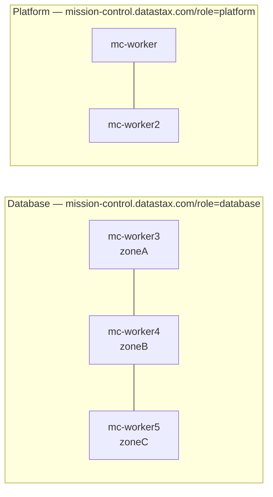

# Mission Control (Embedded MinIO) Local Runbook 🚀

Welcome to your Mission Control launchpad. This guide gets a local KinD cluster running with Mission Control using **embedded MinIO** and enough guardrails to avoid the classic "why is Loki yelling at me?" moments.

## What this runbook gives you ✨

- A repeatable local setup for Mission Control on KinD.
- Embedded MinIO for Mimir and Loki S3-compatible storage.
- A practical flow from preflight checks to UI login.
- Upgrade and cleanup commands when you want a fresh orbit.

## Concept docs

- [`concepts/README.md`](concepts/README.md): index of all concept documents.
- [`concepts/software-components-wiring.md`](concepts/software-components-wiring.md): complete component inventory and YAML wiring based on actual values.
- [`concepts/deployment-structure.md`](concepts/deployment-structure.md): Helm-first deployment and reconciliation flow with glossary and architecture map.
- [`concepts/understanding-a-deployment-quickly.md`](concepts/understanding-a-deployment-quickly.md): fast triage checklist for understanding any specific deployment.

## What Mission Control is (and why you care)

Mission Control is the management plane for DataStax-powered Cassandra/Kubernetes deployments. Think of it as the "mission dashboard + automation engine" for running data platforms: it provides a UI and APIs to deploy, observe, and operate clusters without hand-wiring every Kubernetes object yourself.

In practice, Mission Control helps you:

- Provision and manage database platform resources from a central control plane.
- Standardize operational workflows (install, upgrade, config, lifecycle operations).
- Surface health, metrics, and logs for faster troubleshooting.
- Apply consistent platform settings across environments.

## Components you get in this local install 🧩

This runbook installs Mission Control plus supporting services commonly needed for a realistic local environment:

- `mission-control-ui`: the web interface you access at `https://localhost:8080`.
- Mission Control platform/control-plane services (APIs, operators, and supporting controllers from the chart).
- `dex`: identity provider used here for local static-password login.
- `cert-manager`: TLS certificate lifecycle automation.
- Observability stack pieces used by Mission Control charts (such as `loki`, `mimir`, and related components, depending on chart values).
- Embedded `minio` (via chart values) as S3-compatible object storage for observability data paths.

## Assumptions ✅

- KinD, `kubectl`, Helm, Docker are already installed.
- You run commands from the repository root directory.
- Helm release name is `mission-control` in namespace `mission-control` (adjust references in `mc-overrides.yaml` if you use different names).

---

## 0️⃣ Run preflight checks (save yourself future pain)

```bash
chmod +x preflight.sh
./preflight.sh
```

---

## 1️⃣ Create a KinD cluster

We create a *named* kind cluster so it does not interfere with existing clusters.

```bash
kind create cluster --name mc --config kind-cluster.yaml
```

Use the new context (which is `kind-mc` when the cluster name is `mc`):

```bash
kubectl config use-context kind-mc
```

Verify cluster health:

```bash
docker ps
kubectl cluster-info
kubectl get nodes
watch kubectl get pods -n kube-system
```

---

## 2️⃣ Install cert-manager

`cert-manager` is Kubernetes' certificate automation controller. It requests TLS certificates from configured issuers, stores them in Kubernetes Secrets, and renews them before expiration so components can keep using HTTPS without manual certificate rotation.

```bash
helm repo add jetstack https://charts.jetstack.io --force-update
helm repo update
```

```bash
helm install cert-manager jetstack/cert-manager \
  --namespace cert-manager \
  --create-namespace \
  --version "v1.16.1" \
  --set crds.enabled=true \
  --set 'extraArgs[0]=--enable-certificate-owner-ref=true'
```

Verify:

```bash
kubectl get pods -n cert-manager
helm list -n cert-manager
```

---

## 3️⃣ Label KinD nodes for Mission Control

Node labels are used by Kubernetes scheduling rules (`nodeSelector` and affinity). This step ensures Mission Control workloads land on compatible nodes and prevents pods from getting stuck in `Pending` because no labeled node matches chart requirements.

`label-nodes.sh` applies a specific local topology (expects at least 5 workers):

- `node-role.kubernetes.io/worker=""` on 5 workers so they are explicitly marked as worker nodes.
- `mission-control.datastax.com/role=platform` on worker 1 and 2 for platform/control-plane style workloads.
- `mission-control.datastax.com/role=database` on worker 3, 4, and 5 for data/database workloads.
- `topology.kubernetes.io/zone=zoneA|zoneB|zoneC` on database workers to simulate multi-zone placement and help spread stateful pods across failure domains.

In short: these labels create predictable placement groups (`platform` vs `database`) and zone-aware scheduling behavior, which is especially important for stateful services.

```bash
./label-nodes.sh
kubectl get nodes --show-labels
```

To get a clear overview of the topology, run:
```bash
kubectl get nodes -L mission-control.datastax.com/role,topology.kubernetes.io/zone,node-role.kubernetes.io/worker
```

**Intended node layout** (after `label-nodes.sh`):



---

## 4️⃣ Prepare Mission Control values (embedded MinIO path)

This lab uses **pinned base + overrides** as the standard approach:

- Pin chart defaults once, then keep local changes in overrides.

  ```bash
  helm show values oci://registry.replicated.com/mission-control/stable/mission-control > mc-values.yaml
  ```

  Keep upstream defaults in `mc-values.yaml`; put your environment-specific changes in `mc-overrides.yaml` (Dex login, Loki S3 config, MinIO bucket settings).

- **What "overrides only" means:** running Helm with only `-f mc-overrides.yaml` and no pinned `mc-values.yaml`.
  - This can work for quick tests.
  - But as chart defaults change upstream, your effective configuration can drift between installs.
  - In this lab we intentionally avoid that drift by using pinned base + overrides.

- **Alternative:** start from DataStax [sample values](https://docs.datastax.com/en/mission-control/install/_attachments/sample-values.yaml) and the [official installation docs](https://docs.datastax.com/en/mission-control/install/install-mc-helm.html).

> [!NOTE]
> Embedded MinIO behavior:
> - `mimir.minio.enabled: true` deploys in-cluster MinIO for Mimir.
> - Loki points to the same S3 API endpoint: `<release>-minio.<namespace>.svc.cluster.local:9000`.
> - Loki credentials are read from the MinIO Secret. For release `mission-control`, Secret name is `mission-control-minio` and keys are `rootUser` / `rootPassword`.
>
> Verify Secret contents after install:
>
> ```bash
> kubectl describe secret -n mission-control mission-control-minio
> ```

> [!NOTE]
> If you use a different Helm release name, update `mc-overrides.yaml` references:
> - `secretKeyRef` names for MinIO credentials
> - `loki.loki.storage.s3.endpoint`

> [!TIP]
> Helm merges values by replacing entire lists when an override sets that list key. Do not reduce `loki.loki.schemaConfig.configs` to a minimal stub or Loki can fail with `invalid schema version`. The provided `mc-overrides.yaml` includes the complete schema config and full `loki.read` / `loki.write` / `loki.backend` `extraArgs`, including `-config.expand-env=true` for `${ACCESSKEYID}` expansion.

## 5️⃣ Generate login credentials for the Mission Control UI

> [!NOTE]
> The default `mc-overrides.yaml` in this lab already includes a local Dex user:
> - email: `mission-control@example.com`
> - password: `cassandra`
>
> This is for local/lab convenience only. Change credentials for any shared or persistent environment as explained below.

Only if you want to customize the authoentication, generate a bcrypt hash for Dex admin login:

```bash
echo 'your-password-here' | htpasswd -BinC 10 admin | cut -d: -f2
```

Example hash for password `cassandra`:

`$2y$10$/HEpa1XeKTfrhhqCa0oP1uAUr28cXD7cjfBUUNI/wA6eZwkMAxIYC`

Set Dex static credentials in `mc-overrides.yaml` under `dex.config`:

```yaml
dex:
  config:
    enablePasswordDB: true
    staticPasswords:
      - email: "<your-email-address>"
        hash: "<your-bcrypt-hash>"
        username: admin
```

---

## 6️⃣ Login to Mission Control OCI registry

An OCI (Open Container Initiative) registry is a container/artifact registry that stores versioned packages. Helm can pull charts from OCI registries (instead of classic Helm repos), and Mission Control charts are distributed from `registry.replicated.com` using the `oci://...` reference you use in install/upgrade commands.

Copy `.env.example` to `.env`, then set:

- `MC_REGISTRY_USERNAME`
- `MC_REGISTRY_PASSWORD`

Login:

```bash
helm registry login registry.replicated.com \
  --username "$(sed -n 's/^MC_REGISTRY_USERNAME=//p' .env)" \
  --password "$(sed -n 's/^MC_REGISTRY_PASSWORD=//p' .env)"
```

---

## 7️⃣ Install Mission Control (control plane)

Use the lab standard: **pinned base + overrides**.

```bash
helm install mission-control oci://registry.replicated.com/mission-control/stable/mission-control \
  -f mc-values.yaml \
  -f mc-overrides.yaml \
  --namespace mission-control \
  --create-namespace
```

Watch the rollout:

```bash
watch kubectl get pods -n mission-control
```

Quick confidence checks:

```bash
helm list -n mission-control
kubectl get svc -n mission-control
kubectl get pods -n mission-control
kubectl get pvc -n mission-control
```

To find out which pods run on which node in the topology, run:
```bash
kubectl get pods -n mission-control -o wide
```

For a sorted list by node:
```bash
kubectl get pods -n mission-control \
  -o custom-columns='NODE:.spec.nodeName,NAME:.metadata.name,STATUS:.status.phase' \
  --sort-by=.spec.nodeName
```

**Example runtime topology** (pods in `mission-control` after a successful install; placement may vary slightly by chart version):

| Node | Role | Zone | Example pods |
|------|------|------|----------------|
| `mc-worker` | platform | — | `mission-control-operator`, `mission-control-k8ssandra-operator`, `mission-control-dex-*`, `loki-write-0`, `mission-control-minio-*`, `mission-control-mimir-distributor-*`, `mission-control-loki-gateway-*` |
| `mc-worker2` | platform | — | `mission-control-ui-*`, `mission-control-cass-operator-*`, `mission-control-aggregator-0`, `loki-read-*`, `loki-backend-0`, `replicated-*`, `mission-control-kube-state-metrics-*` |
| `mc-worker3` | database | zoneA | `mission-control-mimir-alertmanager-0`, `mission-control-mimir-compactor-0`, `mission-control-mimir-ingester-1`, `mission-control-mimir-query-frontend-*`, `mission-control-mimir-query-scheduler-*` |
| `mc-worker4` | database | zoneB | `mission-control-mimir-gateway-*`, `mission-control-mimir-ingester-0`, `mission-control-mimir-querier-*`, `mission-control-mimir-ruler-*` |
| `mc-worker5` | database | zoneC | `mission-control-mimir-ingester-2`, `mission-control-mimir-store-gateway-0`, `mission-control-mimir-querier-*`, `mission-control-mimir-query-scheduler-*`, `mission-control-crd-patcher-*`, `mission-control-mimir-make-minio-buckets-*` |

---

## 8️⃣ Access the Mission Control UI

Port-forwarding is used here because the UI service is internal to the KinD cluster network. `kubectl port-forward` creates a temporary local tunnel so you can open the UI at `localhost` without configuring Ingress, DNS, or a load balancer for this lab.

```bash
kubectl port-forward svc/mission-control-ui -n mission-control 8080:8080
```

Open:

- `https://localhost:8080`
- Login with Dex credentials from `mc-overrides.yaml`.
- Defaults provided in this lab: `mission-control@example.com` / `cassandra`.

If the page does not load, first check if the `mission-control-ui` service exists and pods are ready in the `mission-control` namespace.

---

## 9️⃣ Upgrade after chart changes

Use the same lab standard: **pinned base + overrides**. This means you make your changes in `mc-overrides.yaml`.

```bash
helm upgrade mission-control oci://registry.replicated.com/mission-control/stable/mission-control \
  -f mc-values.yaml \
  -f mc-overrides.yaml \
  --namespace mission-control
```

---

## 💤 Pause, resume, and cleanup options

Use the option that matches how long you are away and what you want to keep.

| Option | What it keeps | What it stops | Best for |
|--------|----------------|---------------|----------|
| **A — Docker pause** | KinD cluster, Mission Control install, PVCs, node labels | CPU on `mc-*` containers (host RAM mostly retained) | Same-day break (hours), quick freeze |
| **B — Docker stop** | Cluster data on disk inside node containers | CPU and host RAM used by `mc-*` containers | Overnight break, need memory back without full reinstall |
| **C — Helm uninstall** | KinD cluster, cert-manager, node labels | Mission Control release and `mission-control` namespace | Reinstall MC with new values on same cluster |
| **D — KinD delete cluster** | Nothing in-cluster | Whole `mc` cluster and all namespaces | Multi-day break, flaky cluster, fresh lab |

### Option A: Docker pause / resume (KinD nodes)

**What it does:** Freezes the `mc-control-plane` and `mc-worker*` containers at the Docker level. Kubernetes state (etcd, PVCs, Helm release) stays on disk inside those containers.

**Pros:** Fast; no reinstall when you come back.

**Cons:** `kubectl`, port-forwards, and the UI do not work while paused. After long pauses, resume can be flaky (stale leases, pods not ready). **Does not free host RAM** — processes stay in memory, only frozen.

```bash
ids=$(docker ps -q --filter "name=mc-")
[ -n "$ids" ] && docker pause $ids
```

Resume:

```bash
ids=$(docker ps -q --filter "name=mc-")
[ -n "$ids" ] && docker unpause $ids
```

Then verify: `kubectl get nodes` and `kubectl get pods -n mission-control`.

### Option B: Docker stop / start (KinD nodes)

**What it does:** Stops the `mc-*` KinD node containers (processes exit). Container filesystems and cluster state remain on disk; you start the same containers later — no `kind create` required.

**Pros:** Frees **host CPU and RAM** while stopped. Keeps the lab install (Helm release, PVCs, labels) if resume succeeds.

**Cons:** `kubectl` and the UI are down while stopped. Resume takes longer than pause (nodes and pods must come back). Occasional instability after stop/start; if the cluster does not recover, use **Option D**.

Stop:

```bash
ids=$(docker ps -q --filter "name=mc-")
[ -n "$ids" ] && docker stop $ids
```

Start (includes already-stopped containers):

```bash
ids=$(docker ps -aq --filter "name=mc-")
[ -n "$ids" ] && docker start $ids
```

Then wait and verify (can take several minutes):

```bash
kubectl config use-context kind-mc
kubectl get nodes
kubectl get pods -n mission-control
```

> [!WARNING]
> Use `docker stop` / `docker start` only. Do **not** `docker rm` the `mc-*` containers — that removes nodes and breaks the cluster.

### Option C: Remove Mission Control, keep KinD

**What it does:** Removes the Helm release and the `mission-control` namespace (pods, PVCs, secrets for MC/Loki/Mimir/MinIO in that namespace). The KinD cluster `mc`, cert-manager, and node labels from `label-nodes.sh` remain.

**Pros:** Reinstall Mission Control quickly with changed `mc-overrides.yaml` without recreating KinD.

**Cons:** Does **not** remove HCD/Cassandra clusters you created in **other** namespaces via the UI — delete those separately. `cert-manager` in namespace `cert-manager` is left installed on purpose.

```bash
helm uninstall mission-control -n mission-control
kubectl delete namespace mission-control
```

Reinstall from section 7 (and section 3 labels only if you deleted the cluster).

### Option D: Delete the KinD cluster (full reset)

**What it does:** Destroys the entire `mc` cluster: control plane, workers, Mission Control, cert-manager workloads, any HCD clusters, and PVCs inside that cluster.

**Pros:** Clean slate; best after long breaks or when pause/stop resume misbehaves. You do not need Option C first.

**Cons:** Full runbook from section 1 onward (`kind create`, `label-nodes.sh`, cert-manager, Helm install).

```bash
kind delete cluster --name mc
```

> [!NOTE]
> Registry login (section 6) may be required again before the next `helm install`.
