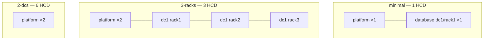

# Setting up Kubernetes (KinD)

This guide creates the local **KinD** cluster `mc`, applies topology labels for HCD scheduling, and verifies nodes before you install Mission Control.

**Next:** [Mission Control install (step 2)](../02-mission-control/README.md) — MC install is identical for all topologies.

## Prerequisites

- **Repository root:** run all commands from the root of this git clone (`kind/`, `scripts/` paths are relative to it).
- Docker, KinD, `kubectl`, and Helm are installed on the host.
- Cluster name is **`mc`** (kubectl context `kind-mc`).

## Preflight

```bash
./scripts/preflight-check.sh
```

Checks CLI tools and Docker.

## Topology profiles {#topology-profiles}

Pick **`minimal`**, **`3-racks`**, or **`2-dcs`** once — you will reuse the same value as `PROFILE` in [HCD install](../03-hcd/README.md).

Default: **`minimal`**. Use **`3-racks`** or **`2-dcs`** when you need more racks or datacenters.

| Profile | KinD config | Workers | HCD layout |
|--------|-------------|---------|------------|
| **minimal** (default) | `kind/kind-cluster-minimal.yaml` | 1 platform + 1 database | 1 DC, 1 rack, 1 HCD node |
| **3-racks** | `kind/kind-cluster-3-racks.yaml` | 2 platform + 3 database | 1 DC, 3 racks |
| **2-dcs** | `kind/kind-cluster-2-dcs.yaml` | 2 platform + 6 database | 2 DCs × 3 racks |

| Label | Meaning |
|-------|---------|
| `mission-control.datastax.com/role` | `platform` or `database` (set at KinD join) |
| `topology.kubernetes.io/region` | Datacenter (`dc1`, `dc2`) — from `scripts/apply-topology-labels.sh` |
| `topology.kubernetes.io/zone` | Rack (`rack1`, …) |

See also [`kind/README.md`](../../kind/README.md) for config file names.



> **Resource use:** **minimal** = 3 KinD nodes. **3-racks** = 6 nodes. **2-dcs** = 9 nodes and the most RAM. All `charts/hcd/*.yaml` use the same lab sizing per Cassandra pod (`512Mi` heap, `1280Mi` memory request, `2Gi` PVC).

## Create the cluster

```bash
export PROFILE=minimal   # minimal | 3-racks | 2-dcs

kind create cluster --name mc --config kind/kind-cluster-${PROFILE}.yaml
./scripts/apply-topology-labels.sh "${PROFILE}"
```

| `PROFILE` | KinD nodes | HCD layout (step 3) |
|-----------|------------|---------------------|
| `minimal` | 3 | 1 DC, 1 rack, 1 pod |
| `3-racks` | 6 | 1 DC, 3 racks, 3 pods |
| `2-dcs` | 9 | 2 DCs × 3 racks, 6 pods |

## Verify

```bash
kubectl config use-context kind-mc
docker ps --filter name=mc-
kubectl cluster-info
kubectl get nodes
```

Confirm topology labels on the nodes:
```bash
kubectl get nodes -L mission-control.datastax.com/role,topology.kubernetes.io/region,topology.kubernetes.io/zone
```

For the `2-dcs` topology your workers would look as follows:

```text
NAME               STATUS   ROLES           AGE    VERSION   ROLE       REGION   ZONE
mc-control-plane   Ready    control-plane   160m   v1.35.0                       
mc-worker          Ready    <none>          160m   v1.35.0   platform            
mc-worker2         Ready    <none>          160m   v1.35.0   platform            
mc-worker3         Ready    <none>          160m   v1.35.0   database   dc1      rack1
mc-worker4         Ready    <none>          160m   v1.35.0   database   dc1      rack2
mc-worker5         Ready    <none>          160m   v1.35.0   database   dc1      rack3
mc-worker6         Ready    <none>          160m   v1.35.0   database   dc2      rack1
mc-worker7         Ready    <none>          160m   v1.35.0   database   dc2      rack2
mc-worker8         Ready    <none>          160m   v1.35.0   database   dc2      rack3
```

> **ROLES vs ROLE:** **ROLES** is the Kubernetes node role; **ROLE** is `mission-control.datastax.com/role`.

## Pause, stop, or delete the cluster

| Option | Keeps | Frees host RAM? | Use when |
|--------|--------|-----------------|----------|
| **Pause** (`docker pause`) | Full cluster state | No (frozen in memory) | Short break |
| **Stop** (`docker stop`) | Disk inside node containers | Yes | Overnight |
| **Delete** (`kind delete cluster`) | Nothing | Yes | Full reset |

**Pause / resume:**

```bash
ids=$(docker ps -q --filter "name=mc-")
[ -n "$ids" ] && docker pause $ids
# resume:
[ -n "$ids" ] && docker unpause $ids
```

**Stop / start** (do not `docker rm` the nodes):

```bash
ids=$(docker ps -q --filter "name=mc-")
[ -n "$ids" ] && docker stop $ids
# start:
ids=$(docker ps -aq --filter "name=mc-")
[ -n "$ids" ] && docker start $ids
kubectl config use-context kind-mc
kubectl get nodes
```

**Delete cluster** (removes all namespaces, PVCs, Mission Control, HCD):

```bash
kind delete cluster --name mc
```

After delete, redo this guide from **Create the cluster** (same or new `PROFILE`), then [Mission Control install](../02-mission-control/README.md).
